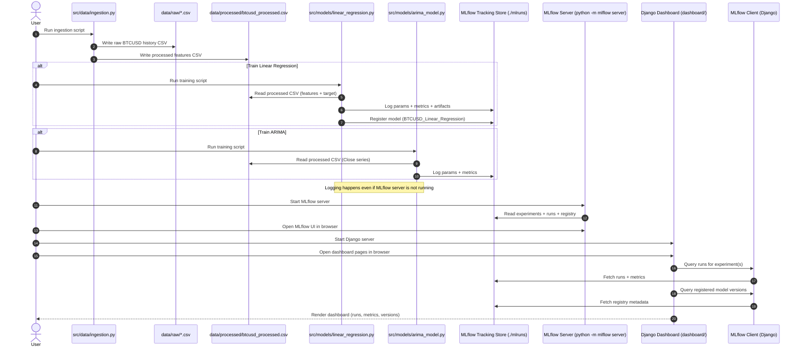
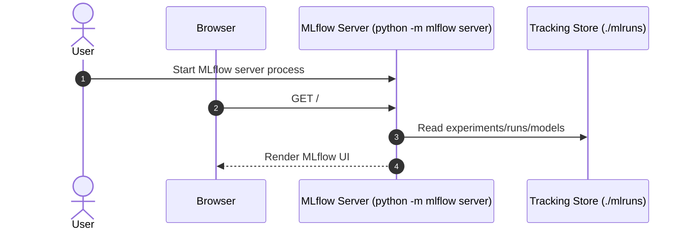
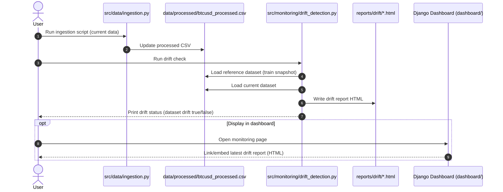
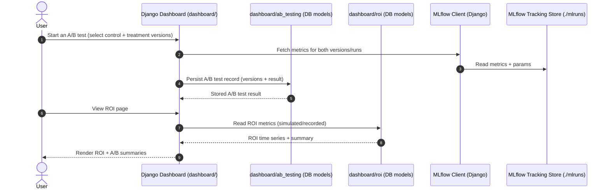

# Sequence Diagram: End-to-End Flow

This file documents how the project components trigger and interact end-to-end:
- Data ingestion produces CSVs used by training and monitoring.
- Model training logs runs and (optionally) registers models in MLflow.
- MLflow server exposes the UI for experiments and registry.
- Django dashboard reads experiment + registry metadata from MLflow.
- Drift detection compares reference vs current datasets and produces an HTML report.
- A/B testing and ROI modules use stored metrics (and model versions) to compare outcomes.

## How MLflow “Starts” the System (It Doesn’t)

MLflow does not orchestrate or trigger ingestion/training/dashboard by itself.

In this repo, MLflow is used in a passive way:
- Training scripts call MLflow APIs (`mlflow.start_run`, `mlflow.log_metric`, `mlflow.log_model`) while they run.
- Those APIs write metadata + artifacts into the tracking backend (currently the local filesystem at `./mlruns`).
- The MLflow server is only a UI/API layer that reads from the same tracking backend so you can view runs in the browser.
- Django uses `MlflowClient()` to read run/registry metadata at request-time. Depending on configuration, it can read from the local store or from a remote tracking server.

Two common modes:
- Local-only (no MLflow server): scripts still log to `./mlruns`; you just don’t have the web UI.
- With MLflow server: you start the server process; the UI becomes available and reads the same `./mlruns` store.

## Main Flow (Ingestion → Training → MLflow → Dashboard)



## MLflow Server Access Pattern (UI)

This is the part that often causes confusion: the MLflow server does not “start training”; it only serves the UI/API.



## When You See HTTP 403 on MLflow UI

Some environments block `localhost` access due to MLflow’s security middleware defaults.
If needed, start MLflow with explicit host/CORS/allowed-hosts for development:

```bash
python3 -m mlflow server --host 0.0.0.0 --port 5001 --backend-store-uri ./mlruns --allowed-hosts "*" --cors-allowed-origins "*"
```

## Monitoring Flow (Drift Detection)



## A/B Testing & ROI Flow (High-Level)



## Trigger Summary

- Ingestion is user-triggered by running [ingestion.py](file:///Users/amolc/2026/timeseries/src/data/ingestion.py), producing raw + processed CSV outputs.
- Training is user-triggered by running:
  - [linear_regression.py](file:///Users/amolc/2026/timeseries/src/models/linear_regression.py)
  - [arima_model.py](file:///Users/amolc/2026/timeseries/src/models/arima_model.py)
- MLflow UI is user-triggered by starting the MLflow server (the UI reads from the tracking store; it does not trigger training).
- Django UI is user-triggered by starting the Django server; it reads MLflow metadata at request time via `MlflowClient` (local store or remote tracking server, depending on configuration).
- Drift detection is user-triggered by running [drift_detection.py](file:///Users/amolc/2026/timeseries/src/monitoring/drift_detection.py), which writes an HTML report.
